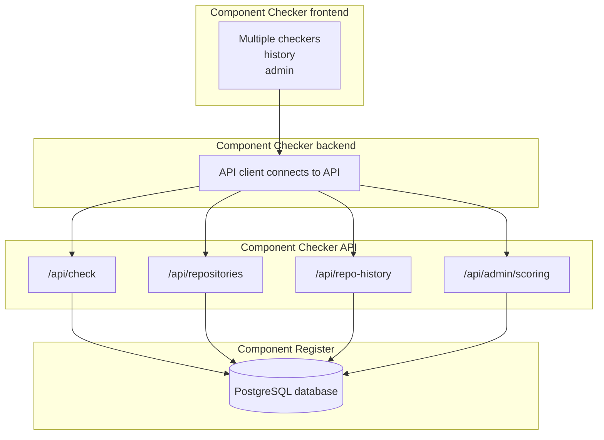
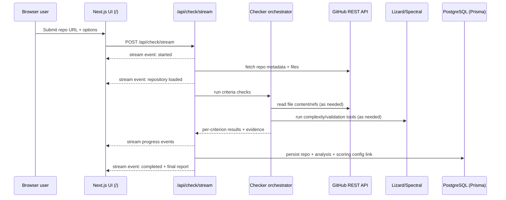

# Common Ground Checker

<p>
	
	
	
</p>

An online automatic compliance checker for [Common Ground](https://commonground.nl) — the Dutch vision and architecture for open, reusable software in municipalities.

## What it checks

Criteria are grouped into four categories. Each criterion has a requirement level (mandatory / recommended / informative) and a configurable weight that influences the overall score.

### Governance

| # | Criterion | Level | Standard |
|---|-----------|-------|----------|
| 1 | **OSI-approved open-source license** — LICENSE file with an OSI-approved identifier | Mandatory | [opensource.org/licenses](https://opensource.org/licenses) |
| 2 | **EUPL license preference** — explicit check whether the repository uses the European Union Public Licence | Mandatory | [EU EUPL](https://interoperable-europe.ec.europa.eu/collection/eupl/eupl-text-eupl-12) |
| 3 | **Copyright / IP owner disclosure** — probable owner inferred from legal files and metadata | Recommended | [opensource.guide/legal](https://opensource.guide/legal/) |
| 4 | **publiccode.yml** — government metadata file in the repository root | Mandatory | [Standard for Public Code](https://standard.publiccode.net) |
| 5 | **Contributing guide** — CONTRIBUTING file explaining how to contribute | Recommended | [GitHub docs](https://docs.github.com/en/communities/setting-up-your-project-for-healthy-contributions/setting-guidelines-for-repository-contributors) |
| 6 | **Code of Conduct** — CODE_OF_CONDUCT file present | Recommended | [opensource.guide](https://opensource.guide/code-of-conduct/) |
| 7 | **Security policy** — SECURITY file with responsible disclosure info | Recommended | [GitHub docs](https://docs.github.com/en/code-security/getting-started/adding-a-security-policy-to-your-repository) |

### Architecture

| # | Criterion | Level | Standard |
|---|-----------|-------|----------|
| 8 | **API-first / OpenAPI spec** — machine-readable OpenAPI or Swagger spec present | Mandatory | [API Design Rules](https://commonground.nl/cms/view/54476259/api-designrules) |
| 9 | **NL API Design Rules (ADR) validation** — OpenAPI / API design is validated against the configured Spectral ruleset | Mandatory | [API Design Rules](https://commonground.nl/cms/view/54476259/api-designrules) |
| 10 | **5-Layer Architecture** — component belongs to a recognised Common Ground layer | Recommended | [5-lagen model](https://commonground.nl/cms/view/54476261/5-lagen-model) |

### Deployment & Operations

| # | Criterion | Level | Standard |
|---|-----------|-------|----------|
| 11 | **Docker support** — Dockerfile (and optionally docker-compose) present | Mandatory | [Haven](https://haven.commonground.nl) |
| 12 | **🐳 Available Docker image** — published registry image URL provided | Mandatory | [Haven](https://haven.commonground.nl) |
| 13 | **CI/CD configuration** — workflow or pipeline config present for automated builds/deployments | Recommended | [GitHub Actions](https://docs.github.com/en/actions/automating-builds-and-tests/about-github-actions) |
| 14 | **Helm chart (Kubernetes)** — Chart.yaml or K8s manifests present | Mandatory | [Haven](https://haven.commonground.nl) |

### Software Quality

| # | Criterion | Level | Standard |
|---|-----------|-------|----------|
| 14 | **Actual source code** — repository contains real source files, not just documentation or configuration | Mandatory | [commonground.nl](https://commonground.nl) |
| 15 | **SBOM** — Software Bill of Materials (SPDX or CycloneDX) published | Recommended | [CISA SBOM](https://www.cisa.gov/sbom) |
| 16 | **Documentation** — README, docs folder, or external docs URL | Mandatory | [irealisatie.nl](https://www.irealisatie.nl/kennis/common-ground) |
| 17 | **Changelog presence** — changelog or release notes file found in the repository | Recommended | [Keep a Changelog](https://keepachangelog.com/en/1.0.0/) |
| 18 | **Test suite** — automated tests or test configuration present | Recommended | [GitHub Actions](https://docs.github.com/en/actions/automating-builds-and-tests) |
| 19 | **Code coverage** — coverage report or badge with at least 80% line coverage | Mandatory | [GitHub Actions](https://docs.github.com/en/actions/automating-builds-and-tests) |
| 20 | **Cyclomatic complexity (Lizard)** — average complexity (AvgCCN) is measured and compared against an admin-configurable threshold | Mandatory | [lizard](https://github.com/terryyin/lizard) |
| 20 | **Code metrics** — repository metrics such as lines of code and function count are collected as informative context | Informative | [commonground.nl](https://commonground.nl) |
| 21 | **OWASP Secure Coding** — heuristic static analysis checks for common insecure patterns | Mandatory | [OWASP Secure Coding Practices](https://owasp.org/www-project-secure-coding-practices/) |
| 22 | **Semantic versioning** — releases or tags following MAJOR.MINOR.PATCH | Recommended | [semver.org](https://semver.org/) |

**Note:** Mandatory criteria are included in the overall score. Recommended criteria still contribute when enabled, while informative criteria are only shown as contextual information and are not used in scoring.

## Getting started

```bash
# 1. Install dependencies
npm install

# 2. Set up the database (using Postgres)
docker-compose up -d db

# 3. Set the access token for Github (optional)
cp .env.local.example .env
# Edit .env and configure GITHUB_TOKEN

# 4. Push the Prisma schema and generate the client
npm run db:push
npm run db:generate

# 5. Install Lizard (required for cyclomatic complexity criterion)
py -m pip install lizard

# 6. Start the development server
npm run dev
```

Open [http://localhost:3000](http://localhost:3000) and paste a GitHub repository URL.

A **GitHub personal access token** in `.env` is optional but strongly recommended — the unauthenticated GitHub API rate limit is 60 requests/hour, which is quickly exhausted for newer repos.

## Tech stack

- **Next.js 16 + React 18 + TypeScript** for the app and server API routes.
- **Tailwind CSS** for styling.
- **PostgreSQL** as the database, accessed through **Prisma** with `@prisma/client` and `@prisma/adapter-pg`.
- **Node.js** runtime for the application and check orchestration.
- **Docker Compose** for local Postgres startup (`docker-compose up -d db`).
- **Vitest** for tests and **ESLint** for linting.

## Security scanning

To scan for leaked credentials/secrets locally with Gitleaks:

```bash
# Install Gitleaks once (Windows)
winget install Gitleaks.Gitleaks

# Scan repository history using the local config
npm run security:secrets
```

The scan uses `.gitleaks.toml` and runs with `--redact` so findings are masked in output.

## Tech stack

### Framework and runtime

- **Next.js 16 (App Router)** for UI routes and server API routes in one project.
- **React 18 + TypeScript** for typed UI and domain models.
- **Node.js runtime** for check orchestration and API integrations.

### Data and persistence

- **PostgreSQL** as the primary data store.
- **Prisma ORM + Prisma PostgreSQL adapter (`@prisma/adapter-pg`)** for type-safe DB access.
- Stores:
  - repository metadata and discovered locations
  - per-run analysis results and evidence
  - versioned scoring configurations linked to each run

### UI and developer tooling

- **Tailwind CSS** for styling.
- **Lucide React** for UI icons.
- **Vitest** for tests.
- **ESLint + TypeScript** for static quality checks.

### Analysis dependencies used by checkers

- **GitHub REST API** for repository content, metadata, and refs.
- **Lizard** (Python CLI) for cyclomatic complexity checks.
- **Spectral** (via `npx`) for ADR/OpenAPI style validation use cases.
- **js-yaml** for YAML parsing (`publiccode.yml`, OpenAPI YAML, Helm-related YAML).
- **jsPDF** for client-side PDF export of analysis results.

## Application architecture

The application is built as a single Next.js service with clear layers:

1. **Presentation layer (React pages/components)**
	- Main checker UI (`/`)
	- Admin scoring UI (`/admin`)
	- History UI (`/history` and repository detail pages)

2. **API layer (Next.js route handlers under `/api`)**
	- Validates input, orchestrates checks, persists results, and serves history/config data.

3. **Domain/checker layer (`src/lib/checkers`)**
	- Independent criterion checkers (license, OpenAPI, Docker, Helm, docs, tests, complexity, OWASP, etc.).
	- A central orchestrator combines checker results into one weighted score.

4. **Integration layer**
	- GitHub API client (`src/lib/github.ts`)
	- External tool invocations (Lizard/Spectral)

5. **Persistence layer**
	- Prisma client singleton (`src/lib/db.ts`) + PostgreSQL schema (`prisma/schema.prisma`).

### Architecture diagram



### Streamed check sequence (`/api/check/stream`)



## APIs

### Internal API endpoints

| Method | Endpoint | Purpose |
|---|---|---|
| `GET` | `/api/openapi` | Retrieve the machine-readable OpenAPI specification |
| `POST` | `/api/repositories` | Create or update repository metadata |
| `POST` | `/api/repositories/{repoId}/analyses` | Persist a new analysis result for an existing repository |
| `POST` | `/api/check` | Run full analysis and persist result |
| `POST` | `/api/check/stream` | Stream progress/events during analysis |
| `GET` | `/api/admin/scoring` | Retrieve current scoring configuration |
| `POST` | `/api/admin/scoring` | Save new scoring configuration snapshot |
| `GET` | `/api/repositories` | List known repositories with latest summary |
| `GET` | `/api/repo-history` | Return analysis runs/history for repositories |

### ADR Spectral ruleset source (Admin)

On the **Admin** page, the field **"Spectral ruleset source"** controls which ruleset is used for the **NL API Design Rules** check.

- Supported values:
	- URL (for example: `https://static.developer.overheid.nl/adr/ruleset.yaml`)
	- Local file path (for example: `./rulesets/adr.yaml` or `C:/rulesets/adr.yaml`)
- This value is persisted in `ScoringConfig` and applied to new analyses.
- If the field is empty, the app falls back to the default ADR ruleset URL.
- For local file paths, the file must exist on the machine running the app server (not on a remote end-user browser machine).

### External APIs/services

- **GitHub REST API v3** (authenticated with optional `GITHUB_TOKEN`).
- **PostgreSQL** over `DATABASE_URL`.

### Request flow (high level)

1. User submits repo URL and options in the checker form.
2. `/api/check` (or `/api/check/stream`) parses owner/repo and loads remote repo context from GitHub.
3. Checker orchestrator runs criteria (parallel where possible).
4. Weighted score is computed using the selected/persisted scoring config.
5. Result + evidence is stored in PostgreSQL and returned to UI.
6. History/admin pages query internal APIs to show prior runs and config snapshots.

## Scoring

Each check has a configurable **weight** (0–1) set via the Admin page. Weights are stored in the database as versioned snapshots; each analysis run is linked to the exact scoring config used.

For the Lizard complexity criterion, the Admin page also stores a configurable
**average cyclomatic complexity threshold** (AvgCCN). The check passes when a
repository’s measured AvgCCN is at or below this threshold.

Score formula:
```
baseScore = round((Σ statusScore × weight) / (Σ weight) × 100)
score     = min(100, baseScore)
```

Status scores: **Pass** = 1.0 · **Warn / Info** = 0.5 · **Fail** = 0.

| Score | Label |
|-------|-------|
| ≥ 80 | ✅ Compliant |
| 50–79 | ⚠️ Partial |
| < 50 | ❌ Non-compliant |

> **Note:** Automated analysis is indicative only. Architecture checks rely on heuristics. For official certification, contact [commonground.nl](https://commonground.nl).

## License

Copyright © 2026 VNG Realisatie

This project is licensed under the **European Union Public Licence v. 1.2 (EUPL-1.2)**. See [LICENSE](LICENSE) for the full text.
